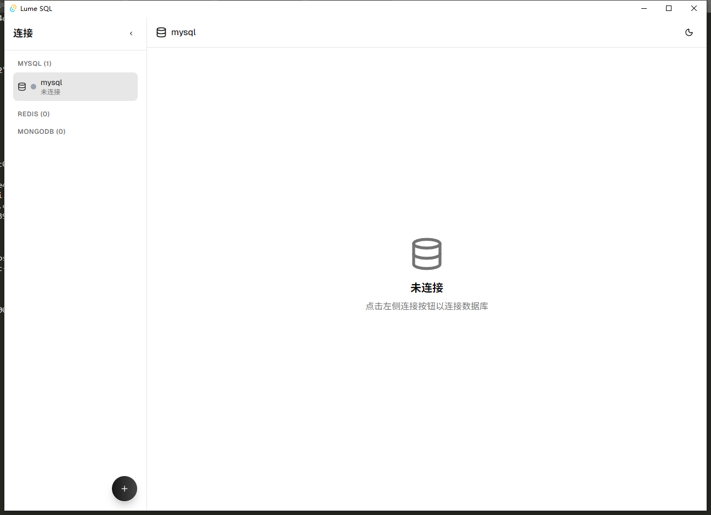
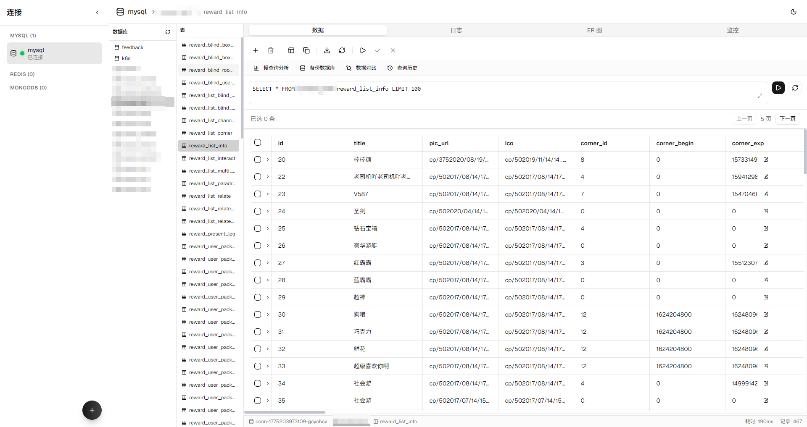
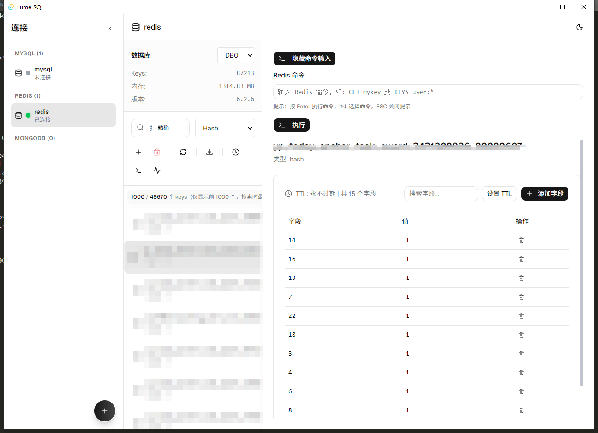
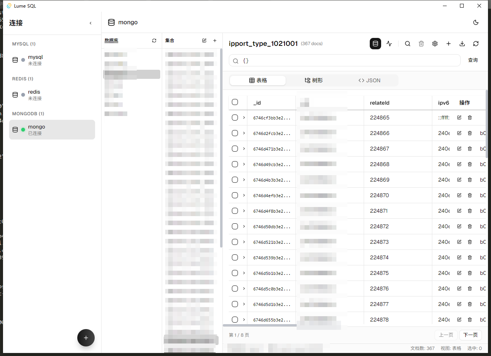
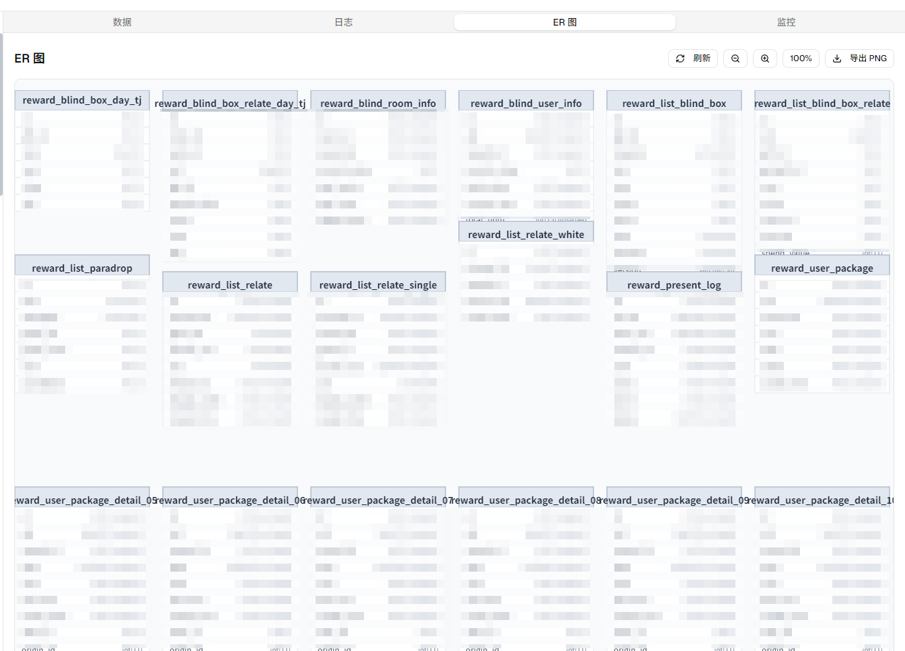
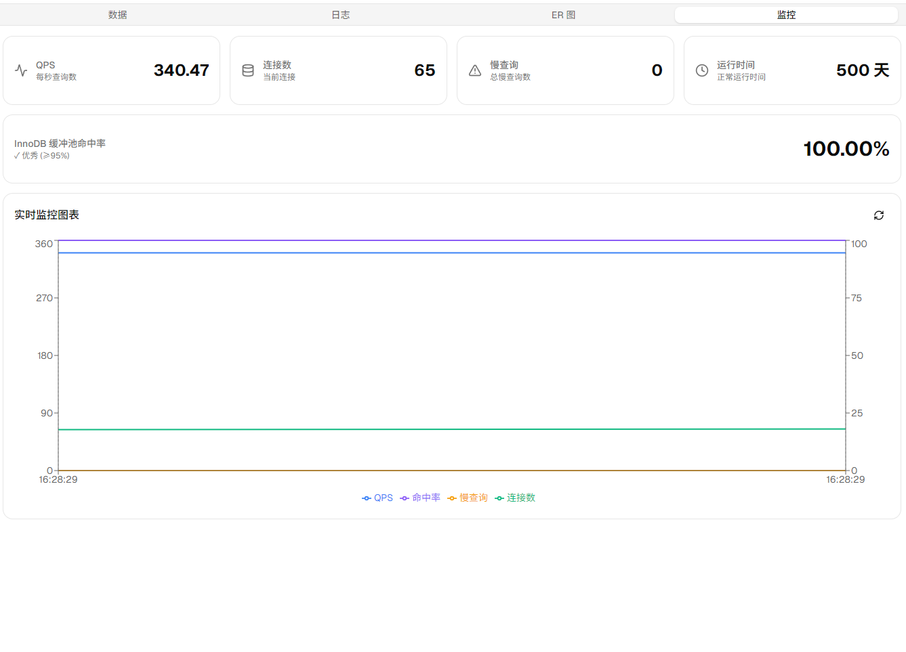

# Lume SQL

<div align="center">


一个基于 Tauri 的现代化多数据库管理工具，支持 MySQL、Redis 和 MongoDB

[功能特性](#功能特性) • [技术栈](#技术栈) • [快速开始](#快速开始) • [开发指南](#开发指南)

Light queries, bright results.

</div>

---

## 项目简介

Lume SQL 是一款功能强大的桌面数据库管理工具，旨在为开发者和 DBA 提供统一、高效的数据库管理体验。通过 Tauri 技术栈构建，它结合了 Web 技术的灵活性和桌面应用的原生性能。

### 核心价值

- **统一管理**：在一个工具中管理 MySQL、Redis 和 MongoDB
- **现代化界面**：基于 React 19 和 Tauri 2 的流畅体验
- **专业功能**：完整的数据库管理能力，从基础查询到高级分析
- **性能优先**：利用 Tauri 的原生性能，提供流畅的用户体验
- **跨平台**：支持 Windows、macOS 和 Linux

---

## 功能特性

### 数据库连接管理

- ✅ 支持多种数据库类型（MySQL、Redis、MongoDB）
- ✅ 配置持久化存储
- ✅ 连接状态实时监控
- ✅ 支持自定义连接参数
- ✅ 连接测试和验证

### MySQL 功能

#### 基础功能
- ✅ 数据库列表查看
- ✅ 表数据浏览和编辑
- ✅ SQL 查询执行
- ✅ 表结构查看和编辑
- ✅ 数据导入导出（CSV、JSON）

#### 高级功能
- ✅ 索引管理（创建、查看、删除）
- ✅ 外键管理（创建、查看、删除、级联操作配置）
- ✅ 视图管理（创建、查看、删除）
- ✅ 存储过程和函数管理
- ✅ 用户权限管理
- ✅ 数据库备份和恢复
- ✅ 事务管理（提交、回滚）
- ✅ 查询执行计划（EXPLAIN）
- ✅ 慢查询日志分析
- ✅ 主从复制监控
- ✅ 表结构对比
- ✅ 数据对比
- ✅ ER 图生成和导出
- ✅ 性能监控面板（QPS、连接数、缓存命中率）
- ✅ SQL 执行日志
- ✅ 审计日志

### Redis 功能

- ✅ Key-value 数据查看和编辑
- ✅ 支持多种数据结构（String、Hash、List、Set、ZSet）
- ✅ 事务操作
- ✅ 慢查询日志分析
- ✅ 连接监控
- ✅ 数据导入导出
- ✅ GEO 地理位置
- ✅ 位操作（BIT 操作）
- ✅ 服务器信息查看
- ✅ 扫描和查询功能

### MongoDB 功能

- ✅ 集合浏览
- ✅ 文档查看和编辑
- ✅ 查询构建器
- ✅ 集合统计
- ✅ 索引管理
- ✅ 数据导入导出
- ✅ 数据库管理

### 用户体验

- ✅ 暗黑/明亮主题切换
- ✅ 响应式设计
- ✅ 自定义快捷键
- ✅ 上下文菜单
- ✅ 查询历史记录
- ✅ 数据同步和对比
- ✅ SQL 编辑器（支持语法高亮、代码提示）

---

## 截图

### 主界面


### MySQL 浏览器


### Redis 浏览器


### MongoDB 浏览器


### ER 图


### 性能监控


---

## 技术栈

### 前端技术

| 技术          | 版本   | 用途           |
| ------------- | ------ | -------------- |
| React         | 19.1.0 | UI 框架        |
| TypeScript    | 5.8.3  | 类型安全       |
| Vite          | 7.0.4  | 构建工具       |
| Tailwind CSS  | 4.2.2  | CSS 框架       |
| Monaco Editor | 4.7.0  | 代码编辑器     |
| Radix UI      | 1.4.3  | 无障碍 UI 组件 |
| Lucide React  | 1.7.0  | 图标库         |
| Zustand       | 5.0.12 | 状态管理       |
| Recharts      | 3.8.1  | 图表库         |

### 后端技术

| 技术    | 版本         | 用途            |
| ------- | ------------ | --------------- |
| Rust    | 2021 edition | 核心后端        |
| Tauri   | 2.0          | 桌面应用框架    |
| MySQL   | 25.0         | MySQL 连接      |
| Redis   | 1.1.0        | Redis 连接      |
| MongoDB | 3.0          | MongoDB 连接    |
| Tokio   | 1.0          | 异步运行时      |
| Serde   | 1.0          | 序列化/反序列化 |
| chrono  | 0.4          | 日期时间处理    |

---

## 快速开始

### 环境要求

- **Node.js** >= 18.0.0
- **Rust** >= 1.70.0
- **操作系统**：Windows 10+, macOS 11+, Linux

### 安装步骤

1. **克隆项目**

```bash
git clone https://github.com/ShighCool/lume-SQL.git
cd lume-sql
```

2. **安装依赖**

```bash
npm install
```

3. **开发模式运行**

```bash
npm run tauri dev
```

4. **构建生产版本**

```bash
npm run tauri build
```

构建完成后，安装包位于 `src-tauri/target/release/bundle/` 目录。

---

## 项目结构

```
lume-sql/
├── src/                          # 前端源代码
│   ├── components/               # React 组件
│   │   ├── ui/                   # UI 组件库
│   │   ├── DatabaseSidebar.tsx   # 数据库侧边栏
│   │   ├── MySQLBrowser.tsx      # MySQL 浏览器
│   │   ├── RedisBrowser.tsx      # Redis 浏览器
│   │   ├── MongoDBBrowser.tsx    # MongoDB 浏览器
│   │   ├── SQLEditor.tsx         # SQL 编辑器
│   │   ├── DataTable.tsx         # 数据表格
│   │   ├── ERDiagramPanel.tsx    # ER 图面板
│   │   ├── DataSyncPanel.tsx     # 数据同步面板
│   │   ├── AuditLogPanel.tsx     # 审计日志面板
│   │   ├── SQLLogPanel.tsx       # SQL 日志面板
│   │   └── ...
│   ├── stores/                   # 状态管理
│   │   ├── connectionStore.ts
│   │   ├── logStore.ts
│   │   └── themeStore.ts
│   ├── types/                    # TypeScript 类型定义
│   │   └── database.ts
│   ├── App.tsx                   # 主应用组件
│   ├── main.tsx                  # 应用入口
│   └── index.css                 # 全局样式
│
├── src-tauri/                    # Rust 后端代码
│   ├── src/
│   │   ├── commands/             # Tauri 命令
│   │   │   ├── mod.rs
│   │   │   ├── mysql.rs          # MySQL 功能实现
│   │   │   ├── redis.rs          # Redis 功能实现
│   │   │   └── mongodb.rs        # MongoDB 功能实现
│   │   ├── lib.rs                # 主入口
│   │   └── main.rs               # Tauri 配置
│   ├── Cargo.toml                # Rust 依赖
│   ├── tauri.conf.json           # Tauri 配置
│   └── build.rs                  # 构建脚本
│
├── docs/                         # 项目文档
│   ├── API.md                    # API 文档
│   ├── ARCHITECTURE.md           # 架构文档
│   ├── DEVELOPMENT.md            # 开发指南
│   ├── MONGODB_FEATURES.md       # MongoDB 功能
│   ├── REDIS_FEATURES.md         # Redis 功能
│   └── ...
├── prompts/                      # 开发提示
├── public/                       # 公共资源
├── FEATURES.md                   # 功能清单
├── package.json                  # Node.js 依赖
└── README.md                     # 项目文档
```

---

## 开发指南

详细的开发指南请参考 [docs/DEVELOPMENT.md](docs/DEVELOPMENT.md)。

### 添加新功能

1. 在对应数据库的命令文件中添加 Rust 函数
2. 在 `src-tauri/src/lib.rs` 中注册 Tauri 命令
3. 在前端创建对应的 React 组件
4. 使用 Tauri 命令调用后端功能.

### 代码规范

- **Rust**: 遵循 `rustfmt` 和 `clippy` 规范
- **TypeScript**: 使用 ESLint 和 Prettier
- **命名约定**：
  - 组件：PascalCase（如 `MySQLBrowser`）
  - 函数：camelCase（如 `getTableData`）
  - 常量：UPPER_SNAKE_CASE（如 `MAX_CONNECTIONS`）

---

## 已知问题

- Redis 命令实现需要进一步完善
- MongoDB 查询构建器功能有限
- 大数据量查询性能需要优化
- 部分高级功能仍在开发中

详细问题列表请查看 [Issues](https://github.com/ShighCool/lume-SQL/issues)。

---

## 未来计划

### 短期目标

- [ ] 完善 Redis 功能实现
- [ ] 优化 MongoDB 查询体验
- [ ] 添加数据库备份计划
- [ ] 改进性能监控指标
- [ ] 添加更多 SQL 编辑器功能（格式化、优化建议）

### 长期目标

- [ ] 支持 PostgreSQL
- [ ] 实现数据库集群管理
- [ ] 添加 SQL 调试器
- [ ] 支持云数据库管理
- [ ] 多语言支持（i18n）
- [ ] 插件系统

---

## 贡献指南

欢迎贡献代码、报告问题或提出建议！

1. Fork 项目
2. 创建特性分支 (`git checkout -b feature/AmazingFeature`)
3. 提交更改 (`git commit -m 'feat: add some AmazingFeature'`)
4. 推送到分支 (`git push origin feature/AmazingFeature`)
5. 开启 Pull Request

详细的贡献指南请参考 [CONTRIBUTING.md](CONTRIBUTING.md)（待创建）。

---

## 许可证

本项目采用 MIT 许可证 - 详见 [LICENSE](LICENSE) 文件。

---

## 联系方式

- 项目地址：[GitHub](https://github.com/ShighCool/lume-SQL)
- 问题反馈：[Issues](https://github.com/ShighCool/lume-SQL/issues)
- 邮箱：56893016@qq.com

---

## 致谢

感谢以下开源项目：

- [Tauri](https://tauri.app/) - 桌面应用框架
- [React](https://react.dev/) - UI 框架
- [Monaco Editor](https://microsoft.github.io/monaco-editor/) - 代码编辑器
- [Tailwind CSS](https://tailwindcss.com/) - CSS 框架
- [Radix UI](https://www.radix-ui.com/) - 无障碍 UI 组件
- [Zustand](https://github.com/pmndrs/zustand) - 状态管理
- [Lucide](https://lucide.dev/) - 图标库
- [Recharts](https://recharts.org/) - 图表库

---

<div align="center">

**如果这个项目对你有帮助，请给个 ⭐️ Star 支持一下！**

Made with ❤️ by Lume SQL Team

</div>